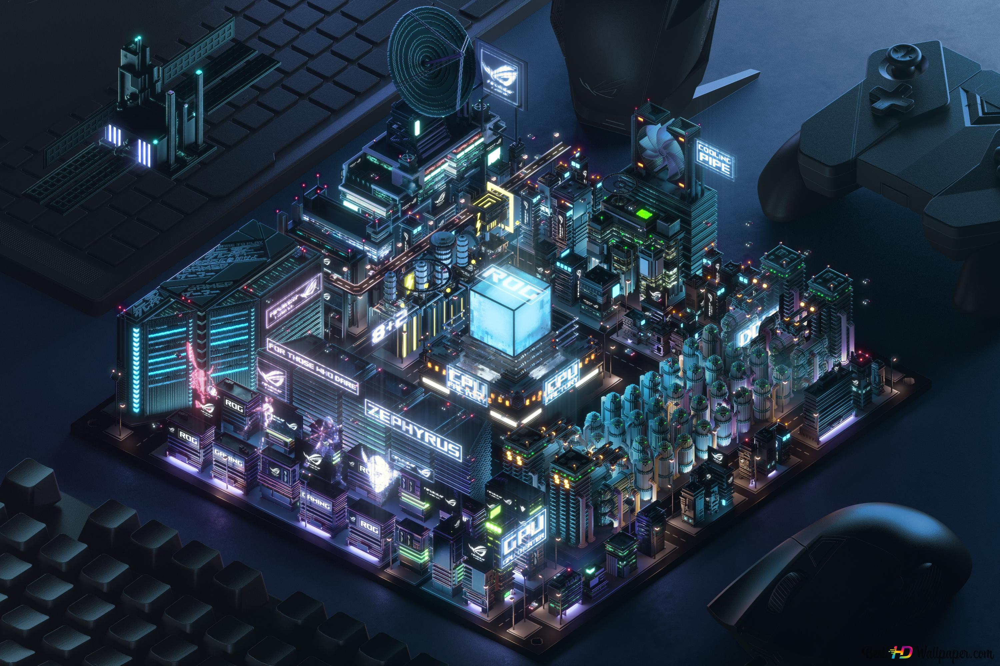

# Hi there, I'm Sarthak Tripathi 👋

### ⚡ Aspiring VLSI Engineer | Electronics Engineering Student @ JIIT

I am a second-year Electronics Engineering student at **Jaypee Institute of Information Technology** with a strong focus on the front-end of VLSI, particularly **RTL design**, **digital logic**, and **Verilog**. I enjoy bridging the gap between abstract logical descriptions and physical silicon.

---

### 🛠️ What I'm Up To
- 🔭 **I’m currently working on**: Refining the **RTL-to-GDSII physical design flow** for an 8-bit ALU using the OpenLane and Sky130 PDK.
- 🌱 **I’m currently learning**: Advanced computer architecture and deep-diving into **Static Timing Analysis (STA)** and multi-corner signoff.
- 👯 **I’m looking to collaborate on**: Open-source hardware projects, custom EDA tool scripts, or RTL-based digital system designs.
- [cite_start]💬 **Ask me about**: Digital Logic, Verilog HDL, the OpenLane flow, or my research into **Edge AI inference**[cite: 19].
- [cite_start]📫 **How to reach me**: [contact.sarthaktripathi@gmail.com](mailto:contact.sarthaktripathi@gmail.com)[cite: 2].

---

### 💻 Technical Toolbox

| Category | Skills & Tools |
| :--- | :--- |
| **Hardware Design** | Verilog HDL, RTL Design, CMOS Logic, Digital Circuit Design |
| **EDA & VLSI Tools** | OpenLane, Magic VLSI, Sky130 PDK, Icarus Verilog, GTKWave |
| **Software & Scripting** | Python, C/C++, MATLAB, Linux |
| **Embedded & Systems** | Arduino, ESP32, PCB Design Fundamentals |

---

### 🚀 Featured Repositories
- **[RTL-to-GDS-ALU](https://github.com/quarky-1/RTL-to-GDS-ALU)**: Complete physical design flow of an 8-bit ALU.
- **[digital-alarm-threshold-comparator](https://github.com/quarky-1/digital-alarm-threshold-comparator)**: MATLAB simulation for digital alarm monitoring with voice control.

---

### 📊 Vital Stats

---

### 🤝 Connect with Me
 

